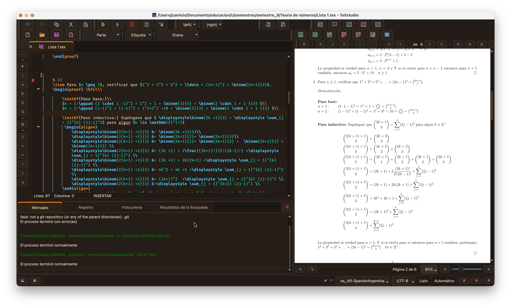

# Brown-Theme-for-TeXstudio
Jus a brown color schem for TexStudio


Download an unzip this repo. 

#  Install manually just the code theme


- 1. Backup your previous TeXstudio settings: Options > Save Profile
- 2.  Options > Load Profile and load Brown_perfil.txsprofile.
(Optional) Works better with Orion Dark: Options > Configure TeXstudio and change the Style.
Restart and boom! It's working!


# Install the interface colors

## Linux


The TeXstudio configuration directory is usually

```bash
cd ~/.config/texstudio/
```

Copy the files

```bash
cp ~/Downloads/Brown-Theme-for-TeXstudio/Brown_stylesheet.qss tylesheet.qss
```


Restart TeXstudio.


---

## macOS

Configuration directory

```bash
cd ~/.config/texstudio/
```

Copy the files

```bash
cp~/Downloads/Brown-Theme-for-TeXstudio/Brown_stylesheet.qss stylesheet.qss

```

Restart TeXstudio.

---

## Windows

Open

```text
%APPDATA%\texstudio\
```

Copy

```text
Brown_stylesheet.qss

```

Restart TeXstudio.

---


# Contributing

Pull requests are welcome.

If you find inconsistencies or want to improve the theme, feel free to open an issue.

